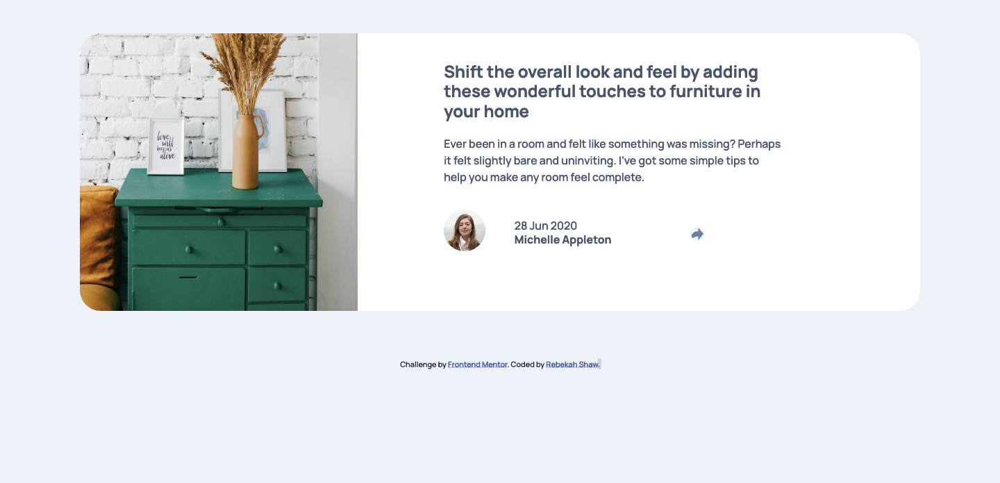
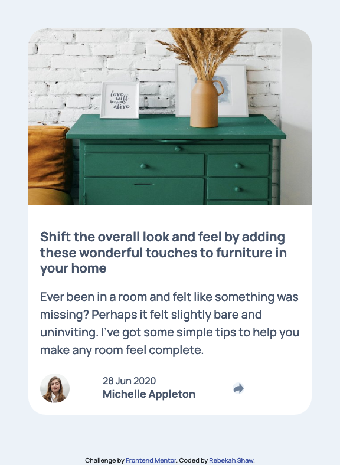

# Frontend Mentor - Article preview component solution

This is a solution to the [Article preview component challenge on Frontend Mentor](https://www.frontendmentor.io/challenges/article-preview-component-dYBN_pYFT). Frontend Mentor challenges help you improve your coding skills by building realistic projects. 

## Table of contents

- [Overview](#overview)
  - [The challenge](#the-challenge)
  - [Screenshot](#screenshot)
  - [Links](#links)
- [My process](#my-process)
  - [Built with](#built-with)
  - [What I learned](#what-i-learned)
  - [Continued development](#continued-development)
  - [Useful resources](#useful-resources)
- [Author](#author)

## Overview

### The Challenge

Users should be able to:

- View the optimal layout for the component depending on their device's screen size
- See the social media share links when they click the share icon

### Screenshot

#### Desktop

#### Mobile

### Links

- Solution URL: [Solution](https://github.com/rebekahshaw92/article-preview-component)
- Live Site URL: [Live Site](https://rebekahshaw92.github.io/article-preview-component/)

## My Process

### Built with

- HTML5
- CSS
- Sass
- Bootstrap 5

### What I Learned

While undertaking this challenge I learned more about Bootstrap 5. I also learn about how to create a popover when a button is clicked.

### Continued Development

I would like to continue learning more about how mobile desgin is used with bootstrap. 

### Useful Resources 

- [Bootstrap](https://getbootstrap.com) - This helped me to learn all about Bootstrap.

- [W3Schools - How To Create Popups](https://www.w3schools.com/howto/howto_js_popup.asp) - This helped me to learn how to create a popover when a button is clicked.

## Author

- Website - [Rebekah Shaw](https://www.rebekahshaw.com)
- Frontend Mentor - [@rebekahshaw92](https://www.frontendmentor.io/profile/rebekahshaw92)
- Twitter - [@x_beckyboo_x](https://www.twitter.com/x_beckyboo_x)

